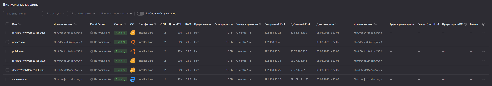

# Отчёт по домашним заданиям

## ДЗ 1. Организация сети

### Манифесты Terraform

- [main.tf](infrastructure/terraform/main.tf)
- [variables.tf](infrastructure/terraform/variables.tf)
- [outputs.tf](infrastructure/terraform/outputs.tf)
- [providers.tf](infrastructure/terraform/providers.tf)

### Результат Terraform

1. `terraform apply` — старт выполнения.

2. `terraform apply` — завершение, ресурсы созданы.

3. Список ВМ в Yandex Cloud: `public-vm`, `private-vm`, `nat-instance`.

### Проверка публичной ВМ

1. Подключение по SSH к `public-vm`.

2. Проверка доступа в интернет с `public-vm` (часть 1).

3. Проверка доступа в интернет с `public-vm` (часть 2).

### Проверка приватной ВМ

1. Подключение по SSH к `private-vm` через `public-vm`.

2. Проверка доступа в интернет с `private-vm` через NAT (часть 1).

3. Проверка доступа в интернет с `private-vm` через NAT (часть 2).

## ДЗ 2. Вычислительные мощности. Балансировщики нагрузки

### Манифесты Terraform

- [main.tf](infrastructure/terraform/main.tf)
- [variables.tf](infrastructure/terraform/variables.tf)
- [outputs.tf](infrastructure/terraform/outputs.tf)
- [providers.tf](infrastructure/terraform/providers.tf)

### Результат Terraform

1. `terraform apply` — старт выполнения.

2. `terraform apply` — завершение, ресурсы созданы.

3. Созданные ресурсы в Yandex Cloud.

4. Стартовый список ВМ в Yandex Cloud.

### Проверка бакета и картинки

1. Проверка бакета в Object Storage.

2. Проверка публичной ссылки на объект (картинку).

### Проверка Instance Group

1. Общая информация по группе.

2. Состав инстансов группы.

3. Статус инстансов/проверок.

### Проверка Network Load Balancer

1. Проверка настроенного балансировщика.

### Проверка веб-страницы через балансировщик

1. Открытие веб-страницы по публичному IP балансировщика.

### Проверка отказоустойчивости

1. Проверка поведения после удаления инстанса (шаг 1).

2. Проверка поведения после удаления инстанса (шаг 2).

3. Проверка поведения после удаления инстанса (шаг 3).

4. Проверка поведения после удаления инстанса (шаг 4).

5. Проверка поведения после удаления инстанса (шаг 5).

6. Проверка поведения после удаления инстанса (шаг 6).

7. Проверка поведения после удаления инстанса (шаг 7).

